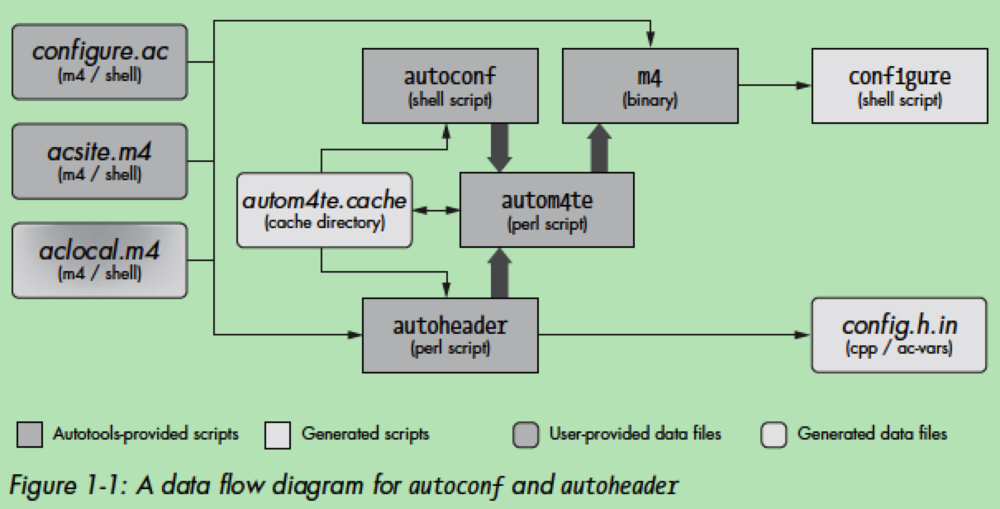
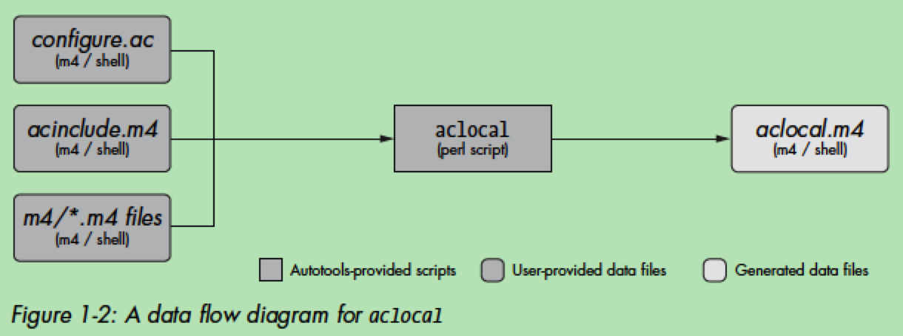
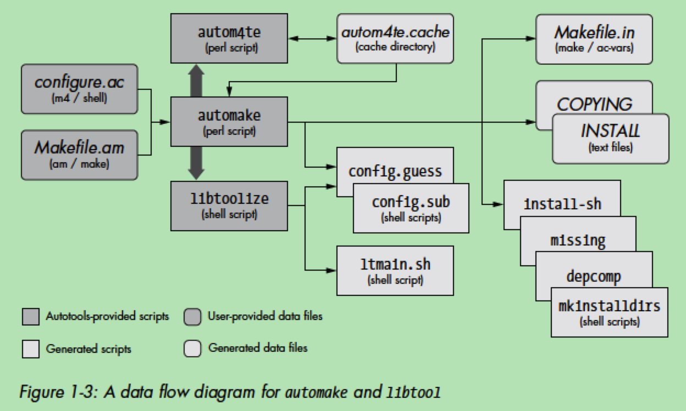
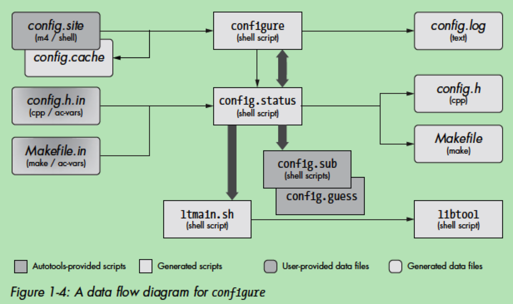
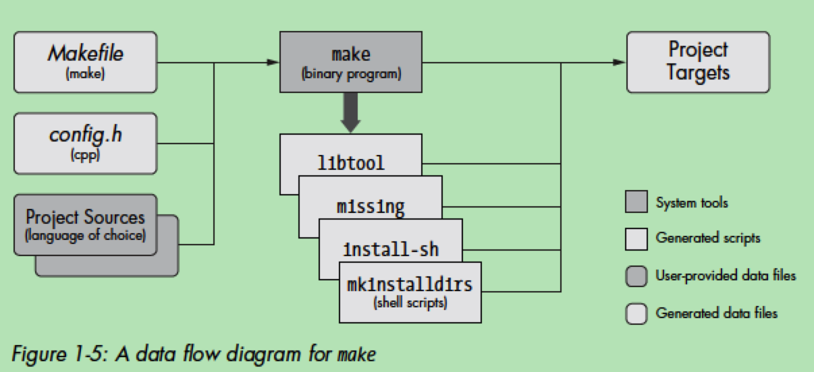

# GNU Autotools

[TOC]

## install


```
[zhoujiagen:~]$ which autoconf
/usr/local/bin/autoconf
[zhoujiagen:~]$ autoconf --version
autoconf (GNU Autoconf) 2.69
Copyright (C) 2012 Free Software Foundation, Inc.
License GPLv3+/Autoconf: GNU GPL version 3 or later
<http://gnu.org/licenses/gpl.html>, <http://gnu.org/licenses/exceptions.html>
This is free software: you are free to change and redistribute it.
There is NO WARRANTY, to the extent permitted by law.

Written by David J. MacKenzie and Akim Demaille.
```
```
[zhoujiagen:~]$ which automake
/usr/local/bin/automake
[zhoujiagen:~]$ automake --version
automake (GNU automake) 1.16.1
Copyright (C) 2018 Free Software Foundation, Inc.
License GPLv2+: GNU GPL version 2 or later <https://gnu.org/licenses/gpl-2.0.html>
This is free software: you are free to change and redistribute it.
There is NO WARRANTY, to the extent permitted by law.

Written by Tom Tromey <tromey@redhat.com>
       and Alexandre Duret-Lutz <adl@gnu.org>.
```

```
[zhoujiagen:~]$ which libtool
/usr/bin/libtool
[zhoujiagen:~]$ libtool -V
Apple Inc. version cctools-906
```

## autoconf

!!! info "autoconf"
    generate a configuration script for a project

### 概念

提供了几个程序:

- autoconf: 一个Bourne Shell脚本, 主要任务是确保当前Shell能够执行M4宏处理器: 解析命令行参数, 执行autom4te. 生成配置脚本configure.
- autoreconf: 执行autoconf、automake、libtool包中的配置工具.
- autoheader: 从configure.ac文件中的构造生成C/C++兼容的头文件模板config.h.in. 执行configure时从config.h.in上生成config.h.
- autoscan: 为新项目生成一个默认的configure.ac文件; 或者增强既有Autotools项目.
- autoupdate: 更新configure.ac或模板文件(.in), 以匹配当前版本Autotools支持的语法.
- ifnames: 接收源文件名称列表, 输出一组C预处理器定义.
- autom4te: M4的智能缓存包装器, 较少后续工具访问configure.ac中构造的时间, 工作目录是autom4te.cache.

autoconf和autoheader被autoreconf直接或间接使用, 接收configure.ac文件和M4宏定义文件, 使用autom4te维护缓存信息.

automake和libtool是可添加到configure.ac中的标准的可插拔选项.


autoconf和autoheader的数据流图:



### 使用autoconf配置项目

autoconf使用的宏语言是M4, 依赖的工具: Bourne shell、M4和Perl解释器.


## automake


!!! info "automake"
    simplify the process of creating consistent and functional makefiles

### 概念

提供了Perl脚本工具:

- automake: 从高层构建描述文件Makefile.am上生成标准makefile模板Makefile.in. Makefile.am本质上是常规的makefile.
- aclocal: 为包含用户定义宏和automake宏的项目生成aclocal.m4文件. 在acinclude.m4中添加用户定义的宏. 最近的实践是在项目根目录下创建m4目录, 放置.m4文件.

aclocal的数据流图:



### 使用automake自动Makefile

## libtool

!!! info "libtool"
    provide an abstraction for the portable creation of shared libraries

### 概念

提供了程序、库和头文件:

- libtool: libtoolize为项目生成的脚本的泛化版本
- libtoolize: 在项目中生成libtool脚本的定制版本. 与automake生成的makefile一起使用.
- ltdl: 静态和共享库
- ltdl.h

automake和libtool的数据流图:



### 使用libtool构建库

## 构建包

### 运行configure

运行autotools后, 生成configure脚本和一些Makefile.in文件.

configure脚本生成的文件:

- Makefile: 从automake创建的Makefile.in模板上生成
- config.h: 从autoheader创建的config.h.in模板上生成

configure的数据流图:



除日志文件外, configure脚本唯一生成的文件是config.status脚本.
configure按configure.ac文件中描述的方式, 确定用户系统上可用的平台特性.


### 运行make




.
