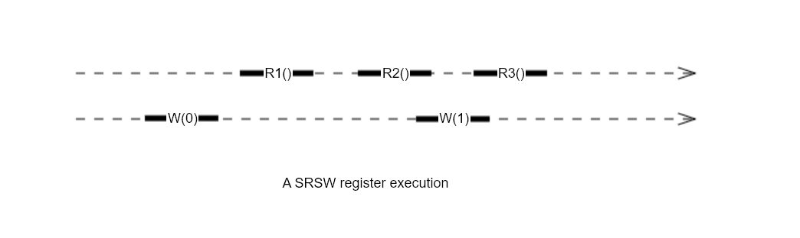

# 4. Foundations of Shared Memory
## 4.1 The Space of Registers

A **read-write register** is an object that encapsulates a value that can be observed by a `read()` method and modified by a `write()` method:

--8<--
tamp/snippets/04/register
--8<--

- $Ri$ is the $i$th read
- $W(v)$ is a write of value $v$
- for safe/regular/atomic registers, $R1$ must return 0, the most recently written value;
- for safe registers, $R2$ and $R3$ are concurrent with $W(1)$, they can return any value in the range of the register;
- for regular registers, $R2$ and $R3$ can each return 0 or 1;
- for atmoic registers, if $R2$ returns 1 then $R3$ also return 1, and if $R2$ returns 0 then $R3$ could return 0 or 1.

A MRSW register implementation is **safe** if 

- A `read()` call that does not overlap a `write()` call returns **the values written by the most recent `write()` call**;
- Otherwise, if a `read()` call overlaps a `write()` call, then the `read()` call may return **any values within the register's allowed range of values**.

A **regular** register is a MRSW register where writes do not happen atomically:

- a regular register is **safe**;
- Suppose a `read()` call overlaps one or more `write()` calls, let $v^{0}$ be the value written by **the latest preceding `write()` call**, and let $v^{1}, ..., v^{k}$ be the sequence of values written by overlapping `write()` calls. The `read()` call may return **any of the $v^{i}$, $0 \le i \le k$**.

Dimensional spaces of read-write register implementations:

- the register size: boolean, multi-valued;
- the number of readers and writers: SRSW, MRSW, MRMW;
- the register's consistency property: safe, regular, atomic.

Notation & Convention:

- Any register implementation defines a total order on the `write()` calls called **the write order**, the order of which writes take effect in the register: 
safe, regular: for SRSW or MRSW, the write order is the same as partial order on method calls; 
atomic: method calls have a linearization order: $W^{0}, W^{1}, ...$. 
- $R^{i}$: any read call that return $v^{i}$, the unique value written by $W^{i}$;
- A history contains only one $W^{i}$ call, but might contain multiple $R^{i}$ calls.

Consistency Properties/Conditions:

!!! info "(4.1.1)"
    No read call returns a value from the future:  
    $\not \exists i \; R^{i} \rightarrow W^{i}$.

!!! info "(4.1.2)"
    No read call returns a value from the distant past, that is the one that precedes the most recently written non-overlapping value:  
    $\not \exists j \; W^{i} \rightarrow W^{j} \rightarrow R^{i}$.

!!! info "(4.1.3)"
    An earlier read cannnot return a value later than that returned by a later read:  
    if $R^{i} \rightarrow R^{j}$ then $i \le j$.

To prove a register implementation is regular, we must show its history satisfy condition (4.1.1) and (4.1.2).

To prove a register implementation is atomic, we must show its history satisfy condition (4.1.1), (4.1.2) and (4.1.3).

## 4.2 Register Constructions
## 4.3 Atomic Snapshots
