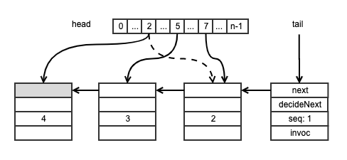
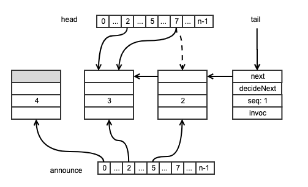

# 6. Universality of Consensus
## 6.1 Introduction

A class is **universal** in a system of $n$ threads if, and only if it has a concensus number greater than or equal to $n$.

A machine architecture or programming language is computationally powerful enough to support arbitrary wait-free synchronization if and only if it provides objects of a universal class as primitives.

|Consensus Number|Object|
|:---|:---|
|$1$|atomic register|
|$2$|getAndSet(), getAndAdd(), Queue, Stack|
|...|...|
|$m$|$(m, \frac{m(m+1)}{2})-assignment register$|
|...|...|
|$\infty$|memory-to-memory move, compareAndSet(), Load-Linked/StoreConditional|

## 6.2 Universality

A class $C$ is **universal** if one can construct a wait-free implementation of any object from some number of objects of $C$ and some number of read-write registers.

## 6.3 A Lock-Free Universal Construction

A generic sequential object:

``` java
public interface SeqObject {
    // Invoc: describe the method being called and its arguments
    // Response: contain the call's termination condition(normal or exceptional) and the return value
    public abstract Response apply(Invoc invoc);
}
```

**Assumption**: Sequential objects are **deterministic**: if we apply a method to an object in a particular state, then there is only one possible response, and one possible new object state.

We can represent any object as a combination of a sequential object in its initial state and a **log**: a linked list of nodes representing the sequence of method calls applied to the object.

``` java hl_lines="19"
public class Node {
    public Invoc invoc;                 // method name and arguments
    public Consensus<Node> decideNext;  // decide next node in the log list
    public Node next;                   // the next node
    public int seq;                     // sequence number
    
    public Node() {
        this.seq = 0;
    }

    public Node(Invoc invoc) {
        this.invoc = invoc;
        this.decideNext = new Consensus<Node>();
        this.seq = 0;
    }

    public static Node max(Node[] array) {
        Node max = array[0];
        for (int i = 1; i < array.length; i++) {
            if(max.seq < array[i].seq) {
                max = array[i];
            }
        }
        return max;
    }
}
```

``` java
public class LockFreeUniversal {
    private Node[] head;
    private Node tail;

    public LockFreeUniversal(int n) { // n threads system
        tail = new Node();
        tail.seq = 1;
        for (int i = 0; i < n; i++) {
            head[i] = tail;
        }
    }

    public Response apply(Invoc invoc) {
        int me = ThreadID.get();
        Node prefer = new Node(invoc);
        while (prefer.seq == 0) {
            // the maximal value keeps track of the head of the log
            Node before = Node.max(head);
            Node after = before.decideNext.decide(prefer);
            before.next = after;
            after.seq = before.seq + 1;
            head[me] = after;
        }

        SeqObject myObject = new SeqObject();
        Node current = tail.next;
        while (current != prefer) {
            myObject.apply(current.invoc);
            current = current.next;
        }

        return myObject.apply(current.invoc);
    }
}
```

> Sample Execution:



1. Thead $2$ wins consensus on `decideNext` in the tail node, appends the second node in the log. It sets the node's sequence number from $0$ to $2$,  and refers to it from its entry in the `head[]` array.
2. Thrad $7$ loses the `decideNext` consensus at the tail node, sets the `next` reference and sequence number of the decided successor node to $2$, and refers to the node from its entry in the `head[]` array.
3. Thread $5$ appends the third node, updates its sequence number to $3$ and update its entry in the `head[]` array to this node.
4. Thread $2$ appends the fourth node, sets its sequence number to $4$, and refers to it from its entry in the `head[]` array.

## 6.4 A Wait-Free Universal Construction

To guarantee that every thread completes an `apply()` call within a finite number of steps, i.e. no thread starves, threads making progress must **help** less fortunate threads to complete their calls.

``` java
public class WaitFreeUniversal {
    // thread first announces its new node, to coordinate helping
    private Node[] announce; 
    private Node[] head;
    private Node tail;
    private int n;

    public WaitFreeUniversal(int n) { // n threads system
        tail = new Node();
        tail.seq = 1;
        this.n = n;
        for (int i = 0; i < n; i++) {
            head[i] = tail;
            announce[i] = tail;
        }
    }

    public Response apply(Invoc invoc) {
        int me = ThreadID.get();
        announce[me] = new Node(invoc);
        head[me] = Node.max(head);

        while (announce[me].seq == 0) {
            Node before = head[me];
            Node help = announce[(before.seq + 1) % n];
            Node prefer;
            if (help.seq == 0) {
                prefer = help;
            } else {
                prefer = announce[me];
            }

            Node after = before.decideNext.decide(prefer);
            before.nex = after;
            after.seq = before.seq + 1;
            head[me] = after;
        }

        SeqObject myObject = new SeqObject();
        Node current = tail.next;
        while (current != announce[me]) {
            myObject.apply(current.invoc);
            current = current.next;
        }
        head[me] = announce[me];
        return myObject.apply(current.invoc);
    }
}
```

> Proof hints: <br/>
> no node is appended twice.<br/>
> any node that is announced is eventually added to the `head[]` array, and
> the announcing thread can complete computation of its outcome.

Let:

- $max(head[])$ be the node with the largest sequence number in the `head[]` array;
- $c \in head[]$ denote the assertion that node $c$ has been assigned to `head[i]` for some $i$;
- $concur(A)$ the set of nodes that have been stored in the `head[]` array since thread $A$'s last announcement;
- $start(A)$ the sequence number of $max(head[])$ when thread $A$ last announced.


``` java hl_lines="20 36 45"
public class WaitFreeUniversal {
    // thread first announces its new node, to coordinate helping
    private Node[] announce; 
    private Node[] head;
    private Node tail;
    private int n;

    public WaitFreeUniversal(int n) { // n threads system
        tail = new Node();
        tail.seq = 1;
        this.n = n;
        for (int i = 0; i < n; i++) {
            head[i] = tail;
            announce[i] = tail;
        }
    }

    public Response apply(Invoc invoc) {
        int me = ThreadID.get();
        <announce[me] = new Node(invoc); start(me) = max(head[]);>
        head[me] = Node.max(head);

        while (announce[me].seq == 0) {
            Node before = head[me];
            Node help = announce[(before.seq + 1) % n];
            Node prefer;
            if (help.seq == 0) {
                prefer = help;
            } else {
                prefer = announce[me];
            }

            Node after = before.decideNext.decide(prefer);
            before.nex = after;
            after.seq = before.seq + 1;
            <head[me] = after; (∀j) (concur(j) = concur(j) ∪ {after})>
        }

        SeqObject myObject = new SeqObject();
        Node current = tail.next;
        while (current != announce[me]) {
            myObject.apply(current.invoc);
            current = current.next;
        }
        <head[me] = announce[me]; (∀j) (concur(j) = concur(j) ∪ {after})>
        return myObject.apply(current.invoc);
    }
}
```

**Invariant**: $\left | concur(A) \right | + start(A) = max(head[])$.


!!! info "Lemma 6.4.1"
    For all threads $A$, the folowing claim is always true:<br/>
    $\left | concur(A) \right | \gt n \implies announce[A] \in head[]$.

!!! info "Lemma 6.4.2"
    The following property always holds:<br/>
    $max(head[]) \ge start(A)$.

!!! info "Lemma 6.4.3"
    The following invariant for class `Node` Line $19$ (i.e. it holds during each iteration of the loop): <br/>
    $max(head[A], head[j], ..., head[n-1] \ge start(A)$, where $j$ is the loop index.

!!! info "Lemma 6.4.4"
    The following assertion holds just before class `WaitFreeUniversal` Line $23$: <br/>
    $head[A].seq \ge start(A)$.
    
!!! info "Lemma 6.4.5"
    The following property always holds:<br/>
    $\left | concur(A) \right | \ge head[A].seq - start(A) \ge 0$.

!!! info "Theorem 6.4.1"
    This algorithm is correct and wait-free.            


> Sample Execution:



1. Thread $5$ announces its new node and appends it to the log, but halts before adding the node the `head[]` array.
2. Thread $7$ will not see thread $5$'s node in the `head[]` array, and will attempt to help thread ($before.seq + 1 \mod n = 2$). <br/>When attempting to help thread $2$, thread $7$ loses the consensus on the tail node's `decideNext` since thread $5$ alreay won.<br/>Thread $7$ therefore completes updating the fields oth thread $5$'s node, setting the node's sequence number to $2$, and adding the node to the `head[]` array.
3. Thread $2$ announces its node and thread $7$ succeeds in appending thread $2$'s node, setting thread $2$'s nodes' sequence number to $3$.<br/>Now thread $2$ wakes up, it will not enter the main loop, but will continue to update the `head[]` array and computes its output value.