# Notes of Netty in Action


Netty高层次的组件图:


## 存在问题

- ChannelHandler在每个服务器实例的每个连接处理中用的是同一个实例? YES

## PART 1 Netty概念和体系结构

|概念|章节|
|:---|:---|
|Netty异步和事件驱动| chapter 1 asynchronous and event-driven<br> chapter 2 Your first Netty application|
|Netty组件和设计| chapter 3 Netty components and design|
|核心网络协议| chapter 4 Transports<br>chapter 5 ByteBuf<br>chapter 6 ChannelHandler, ChannelPipeline|
|并发模型| chapter 7 EventLoop, threading model|
|配置Netty组件| chapter 8 Bootstrapping|
|单元测试| chapter 9 Unit testing|

### 1 asynchronous and event-driven

Netty核心组件: Channel, Callback, Future, Events and handler:

- Channel是Java NIO的基本构造: 打开的实体连接, 实体可以是硬件设备/文件/网络socket/能执行IO操作的软件组件
- Netty内部处理事件时使用Callback, callback被触发时, 事件可以被ChannelHandler实现处理.
- Future提供了另一种操作完成时通知应用的方法. <br>Netty提供了实现 ==ChannelFuture==. ChannelFuture上注册ChannelFutureListener, 异步操作完成时listener#operationComplete()被调用; 避免了轮询检测或阻塞等待结果. Netty的外向(outbound)每个IO操作返回ChannelFuture, 不会阻塞.
- Netty使用不同的事件通知操作状态的改变. <br>Netty事件按inbound/outbound数据流分类:<br><br>
inbound: 连接active/inactive, 读到数据, 用户事件, 错误时间<br>
outbound(操作的结果将会触发动作): 开启/关闭远端链接, 写/刷新数据到socket<br>
每个事件可被分发到ChannelHandler中用户实现的方法.<br>
事件可以在ChannelHandler链中传播.<br>

Netty的异步编程模型建立在Future和Callback概念上, 同时将事件分发给相应的Handler方法.

Netty抽象隔离了Selector, 避免硬编码的分发代码. 给每个Channel分配一个EventLoop, 用于处理所有事件, 包括:

- 注册感兴趣事件
- 将事件分发给ChannelHandler
- 调度远期动作

==EventLoop自身只由一个线程驱动== , 该线程处理一个channel的所有IO事件, 在EventLoop生命周期内不变.

### 2 Your first Netty application

Echo server and Client:

- 客户端建立连接后, 向服务器发送一个或多个消息
- 服务端将消息echo给客户端

Server

- 至少一个ChannelHandler, 实现收到客户端数据后的业务处理逻辑
- 配置服务器的启动代码, 最简情形下绑定端口后监听连接请求

==ChannelHandler==: 处理数据处理逻辑, 将应用逻辑与网络代码解耦.

处理inbound事件, 需要实现 ==ChannelInboundHandler==, 子类 ==ChannelInboundHandlerAdapter==

Client

- SimpleChannelInboundHandler

### 3 Netty components and design

Netty处理了两类问题:

- 技术性: 在Java NIO基础上搭建的异步和事件驱动实现, 保证大负载下应用性能和可扩展性
- 体系结构性: 将应用逻辑与网络层解耦, 简化开发, 最大化可测试性/模块化/代码可重用性

#### Channel, EventLoop, ChannelFuture

- Channel - sockets

Netty的Channel接口简化了Java中Socket的操作. 已有部分实现: <br>
EmbeddedChannel<br>
LocalServerChannel<br>
NioDatagramChannel<br>
NioSctpChannel<br>
NioSocketChannel

- EventLoop - control flow, multithreading, concurrency

EventLoopGroup包含1个或多个EventLoop; <br>
每个EventLoop在其生命周期内绑定到单个Thread; <br>
每个EventLoop处理的所有IO事件, 在其专用的Thread中处理; <br>
每个Channel在其生命周期内只可被注册到单个EventLoop; <br>
单个EventLoop可以被指派给1个或多个Channel.

设计中一个Channel中的IO操作由同一线程处理, 本质上避免了同步开销.

- ChannelFuture - asynchronous notification

Netty中所有IO操作都是异步的, 需要在将来某一时刻检查异步操作的结果. <br>
ChannelFuture中addListener(ChannelFutureListener)方法, 在操作完成时(不管成功还是失败)通知listener. <br>
ChannelFuture表示的操作最终会被执行, 同一个Channel上的操作保证按被调用循序执行.

#### ChannelHandler, ChannelPipeline

ChannelPipeline和ChannelHandler的关系:

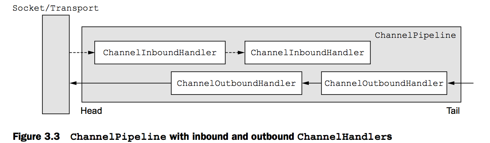


管理数据流和执行应用逻辑.

- ChannelHandler

ChannelHandler是用于处理inbound/outbound数据的应用逻辑的容器. ChannelHandler中方法由网络事件触发. 已有实现: ChannelInboundHandler(接收由应用逻辑处理的inbound事件和数据, 将数据发送给连接的客户端).

ChannelHander的两个扩展: ChannelInboudnHandler, ChannelOutboundHander. Netty区分inbound/outbound的实现, 传递数据/事件时仅会传递给同一方向类型的handler.

- ChannelPipeline

ChannelPipeline是ChannelHandler链的容器, 同时提供了将inbound/outbound事件在链中传播的API. ChannelHandler的安装: ChannelInitializer.initChannel()

- ChannelInitializer

一个特殊的ChannelInboundHandler, 在Channel注册了EventLoop后, 初始化channel的handler链.

- ChannelHandlerContext

表示ChannelHandler与ChannelPipeline之间的结构关系.

==Netty中发送消息的两种方式==: <br>(1) 直接使用Channel#write(..), 消息从ChannelPipeline的tail开始. <br>(2) 使用ChannelHandlerContext#write(..), 消息从ChannelPipeline中下一个ChannelHandler开始.

ChannelHandler的子类型: encoder, decoder, ChannelInboundHandler, ChannelOutboundHandler等

一些adapter: <br>
ChannelHandlerAdapter<br>
ChannelInboundHandlerAdapter<br>
ChannelOutboundHandlerAdapter<br>
ChannelDuplexHandlerAdapter

- encoder, decoder

decoded: 将inbound消息由byte转换为另一种格式, 例如Java对象;
<br> encoded: 将outbound消息由特定格式转换为byte.<br>
命名约定: ByteToMessageDecoder/MessageToByteEncoder, ProtobufEncoder/ProtobufDecoder

Netty中所有encoder/decoder的adapter类均实现了ChannelInboundHandler/ChannelOutboundHandler

SimpleChannelInboundHander#channelRead0(ChannelHandlerContext, T):<br> ChannelInboundHandlerAdapter的子类 直接处理decoded消息, 方法中需要保证当前IO线程不被阻塞.

#### bootstrapping

应用网络层配置的容器

- ServerBootstrap

绑定端口<br>
需要两个EventLoopGroup: 与ServerChannel相关的EventLoopGroup指派的EventLoop, 负责为连接请求创建Channel; 一旦连接请求被接受, 第二个EventLoopGroup为新创建的Channel指派EventLoop.<br>
两类不同的Channel: ServerChannel(服务端监听的socket), 处理客户端链接的Channel<br>

- Bootstrap

连接远端 只需要一个EventLoopGroup

### 4 Transport

案例: 接受连接后, 向连接发送'Hi', 关闭连接.

Netty为不同的transport提供了一致的API.

- OIO: blocking transport `io.netty.channel.socket.oio`
- NIO: asynchronous transport `io.netty.channel.socker.nio`
- Epool: JNI epoll(), unblocking transport `io.netty.channel.epoll`
- local transport: async communication within a JVM `io.netty.channel.local`
- embedded transport: testing ChannelHandlers `io.netty.channel.embedded`

#### Transport API

Channel, AttributeMap, ChannelConfig, ChannelPipeline:<br>
每个Channel都将会被分配一个ChannelPipeline和ChannelConfig. <br>
ChannelConfig包含Channel的所有配置设置, 且支持热更新. <br>
Netty的Channel实现是线程安全的.

ChannelHandler的典型应用:<br>
转换数据格式<br>
发生异常时发布通知<br>
Channel活跃状态改变时发布通知<br>
Channel注册或注销EventLoop时发布通知<br>
对用户自定义事件发布通知

可以动态修改ChannelPipeline: 添加/移除ChannelHandler.

- zero-copy

将数据从文件系统移动到网络接口, 不需要将其从内核控件复制到用户空间.

```
java.nio.channels.FileChannel.transferTo(long, long, WritableByteChannel)
io.netty.buffer.CompositeByteBuf.getByte(int)
```


### 5 ByteBuf

ByteBuf区分了读写索引:

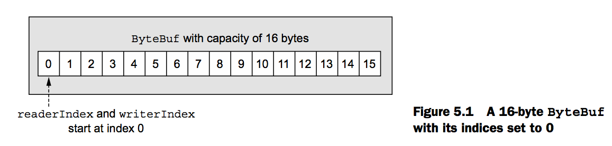

ByteBuf的容量:

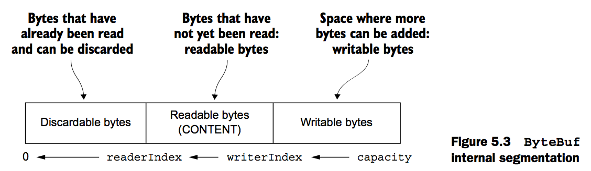

Java ByteBuffer, Netty ByteBuf
ByteBuf, ByteBufHolder

#### ByteBuf

支持用户自定义buffer; 透明的zero-copy: 由内建的聚合buffer类型支持; 读写使用不同的index; 支持引用计数/pooling.
readerIndex, writerIndex readerIndex > writerIndex会抛IndexOutOfBoundsException
ByteBuf#read...()/write...()方法会修改读写索引, 而get...()/set...()不会.
ByteBuf的最大容量默认是Integer.MAX_VALUE
ByteBuf的使用模式
使用堆中buffer
借助本地调用使用OS buffer
聚合Buffer: 多个ByteBuf的聚合视图

#### 字节层次的操作

Random access indexing Sequential access indexing Discardable bytes Readable bytes Writable bytes Index management Search operations Derived buffers Read/write operations

#### ByteBufHolder

包装ByteBuf作为消息的payload使用.

#### ByteBuf分配(allocation)

可以从Channel, ChannelHandlerContext中获取. ByteBufAllocator: PooledByteBufAllocator, UnpooledByteBufAllocator.

#### 引用计数
ReferenceCounted

### 6 ChannelHandler, ChannelPipeline

Channel/ChannelHandler/ChannelPipeline/ChannelHandlerContext的关系:

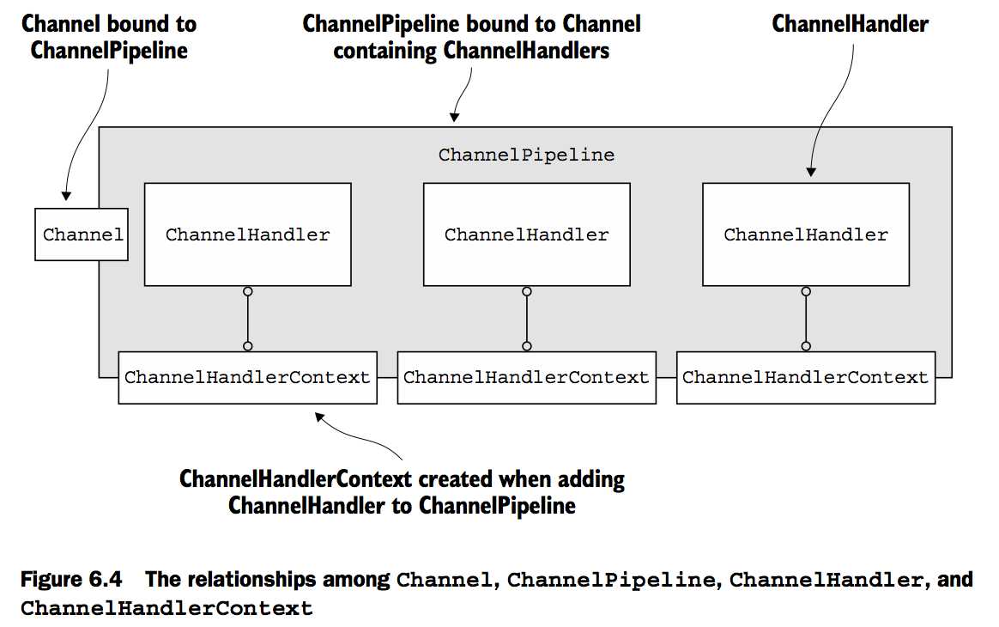


#### ChannelHandler

Channel的生命周期 ChannelRegistered(注册到EventLoop) -> ChannelActive(连接到远端) -> ChannelInactive -> ChannelUnregistered

ChannelHandler的生命周期: 在ChannelPipeline中添加/移除
两个重要的子接口: ChannelInboundHandler, ChannelOutboundHandler
handlerAdded, handlerRemoved, exceptionCaught(异常捕获移动到了ChannelInboundHandler中)

ChannelInboundHandlerAdapter, SimpleChannelInboundHandler 依据是否要将消息传递给下一个ChannelHandler, 调用ReferenceCountUtil#release/retain(msg).

ChannelOutboundHandler可以按需延迟处理操作或事件. ChannelPromise, ChannelFuture的子接口, 提供设置Future结果方法.

资源泄露检测: ResourceLeakDetector 使用java -Dio.netty.leakDetection.level=SIMPLE 值见io.netty.util.ResourceLeakDetector.Level

#### ChannelPipeline

每个Channel创建时被指派一个ChannelPipeline, 这种关系是持久性的.

ChannelHandlerContext辅助ChannelHandler与ChannelPipeline以及其他ChannelHandler交互; 甚至帮助ChannelHandler修改其隶属于的ChannelPipeline.

ChannelHandler在ChannelPipeline中所处的位置由添加时指定.

ChannelPipeline中的ChannelHandler负责处理其关联Channel的EventLoop传递的事件. 不要在ChannelHandler中执行阻塞的操作.
??? - 需要在ChannelHandler中执行阻塞的操作. ChannelPipeline.addLast(EventExecutorGroup group, ChannelHandler... handlers)
If an event is passed to a custom EventExecutorGroup, it will be handled by one of the EventExecutors contained in this EventExecutorGroup and thus be removed from the EventLoop of the Channel itself. For this use case Netty provides an implementation called DefaultEventExecutorGroup.
ChannelHandler由谁调用, 怎么执行???

总结: (1) ChannelPipeline是Channel相关ChannelHander的容器; (2) ChannelPipeline可以动态修改; (3) ChannelPipeline提供了调用inbound和outbound实现的方法.

#### ChannelHandlerContext

ChannelHandlerContext与其它组件的关系图:

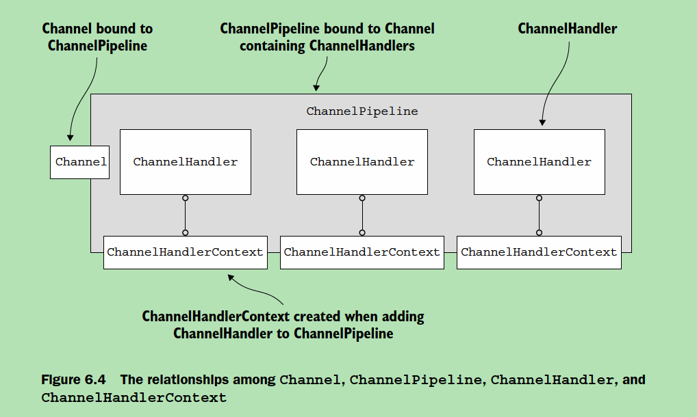

ChannelHandlerContext在ChannelHandler添加到ChannelPipeline时创建, 一旦关联便不再改变, 可以在ChannelHandler中持有其引用.

维护ChannelHandler与其他ChannelHandler之间的交互.
ChannelHandlerContext中有与Channel或ChannelPipeline相同的方法, 如果被调用仅影响下一个ChannelHandler, 而不是像后者影响整个ChannelPipeline.
ChannelHandlerContext#channel()获取关联Channel实例; ChannelHandlerContext#pipeline()获取关联ChannelPipeline实例.
共享ChannelHandler的典型应用是统计多个Channel的指标.

#### 处理异常

一旦inbound ChannelHandler中出现异常, 该异常会流经整个ChannelPipeline; 如果没有在ChannelPipeline中处理异常, Netty会记录日志.
处理outbound异常: (1) 每个outbound操作会返回ChannelFuture, 注册的ChannelFutureListener可用于处理成功或失败情况; (2) ChannelOutboundHaneler的方法一般有ChannelPromise参数, 可用于处理成功或失败情况.

### 7 EventLoop and threading model

线程池模式: Java 5 Executor API, 但无法避免上下文切换的消耗.

Channel/EventLoop/EventLoopGroup的关系:

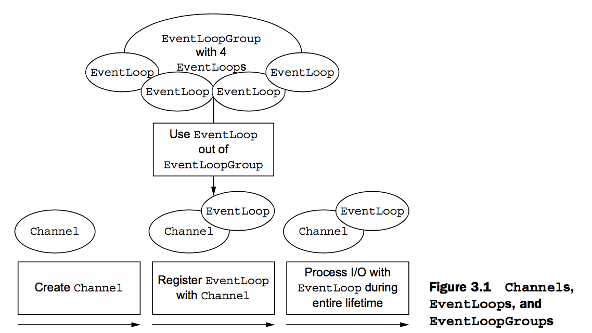

EventLoop的类层次:

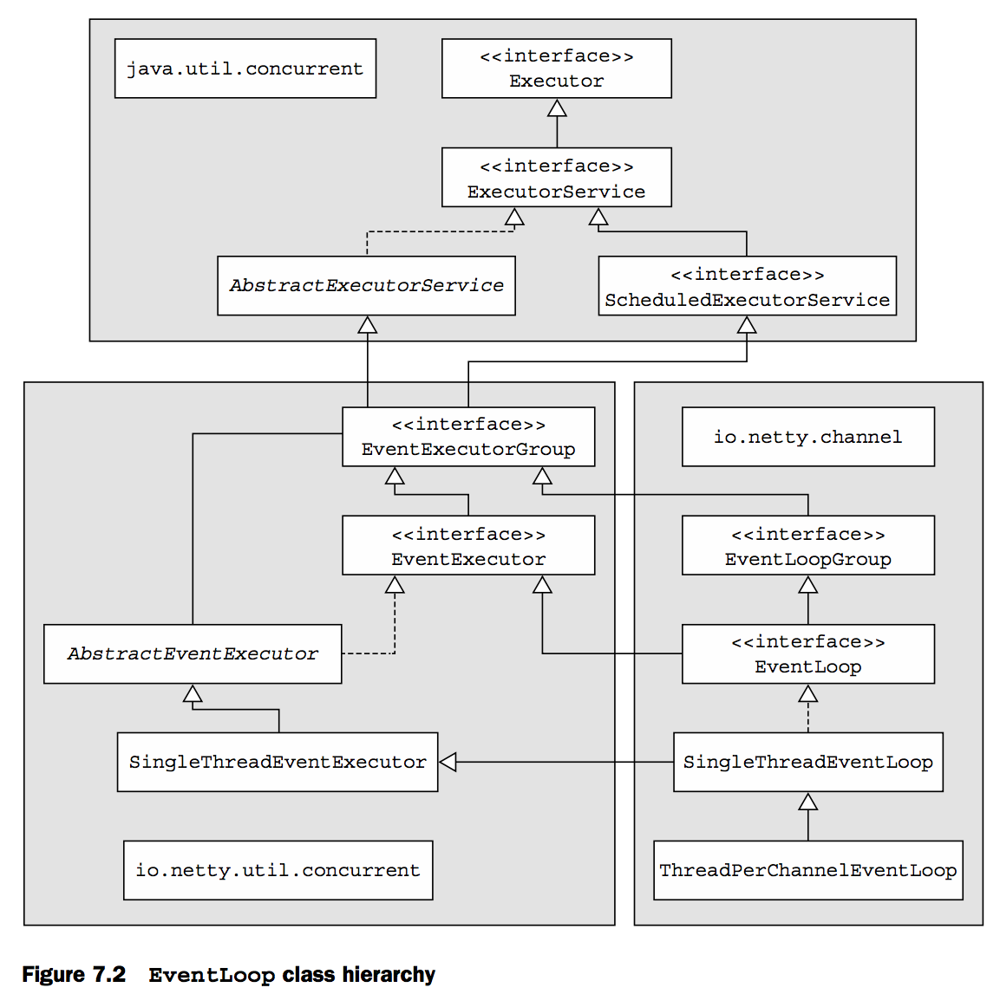

#### EventLoop

`io.netty.channel.EventLoop`: 执行任务处理连接过程中发生的事件.

EventLoop设计融合了并发和网络设计: `io.netty.util.concurrent` (`java.util.concurrent`), `io.netty.channel`.


### 8 Bootstrapping

- Bootstrap
- ServerBootstrap

### 9 unit testing

EmbeddedChannel数据流:

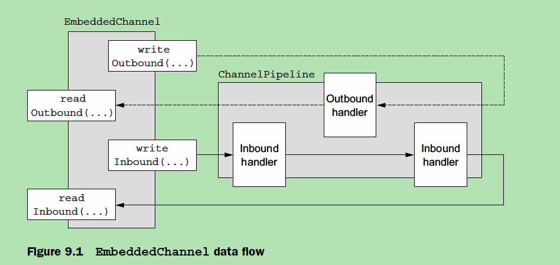

## PART 2 codec

### 10 codec framework

encoder/decoder 应用数据与网络传输格式之间的转换 抽象: 将消息视为由字节构成的结构化数据 encoder: 将消息转换为网络字节流, 即处理outbound数据 decoder: 将网络字节流转换为消息, 即处理inbound数据
codec: 同时具备encoder/decoder功能

#### decoder

处理inbound数据, Netty的decoder实现了ChannelInboundHandler

两类decoder: (1) 字节流=>消息 ByteToMessageDecoder, ReplayingDecoder (2) 消息=>消息 MessageToMessageDecoder
ByteToMessageDecoder 因无法预知远端是否一次性发送完整的消息, 该类会缓存inbound数据
ReplayingDecoder 继承了ByteToMessageDecoder, decode(...)中按已接收到需要的数据处理(避免调用ByteBuf#readableBytes()), 提供了特殊的ByteBuf实现: ReplayingDecoderBuf ReplayingDecoderBuf并没有提供完整的ByteBuf功能.
更多的decoder: io.netty.handler.codec.LineBasedFrameDecoder io.netty.handler.codec.http.HttpObjectDecoder
MessageToMessageDecoder 复杂的示例: io.netty.handler.codec.http.HttpObjectAggregator
TooLongFrameException Netty是异步框架, 在获取足够的字节前会缓存数据, 但缓存太多的字节会引起一些问题. 该异常会被CHannelHandler.exceptionCaught()捕获.

#### encoder

处理outbound数据, Netty的encoder实现了ChannelOutboundHandler

两类encoder: (1) 消息=>字节流 MessageToByteEncoder (2) 消息=>消息 MessageToMessageEncoder
MessageToByteEncoder 既有示例: WebSocket08FrameEncoder
MessageToMessageEncoder 既有示例: ProtobufEncoder

#### codec

Netty的codec实现了ChannelInboundHandler和ChannelOutboundHandler

ByteToMessageCodec 示例POJO: SmtpRequest, SmtpResponse
MessageToMessageCodec
CombinedChannelDuplexHandler: 将encoder和decoder作为一个单元部署 CombinedChannelDuplexHandler

### 11 既有ChannelHandler和code实现

#### Netty application with SSL/TLS

SslHandler(加密)数据流:

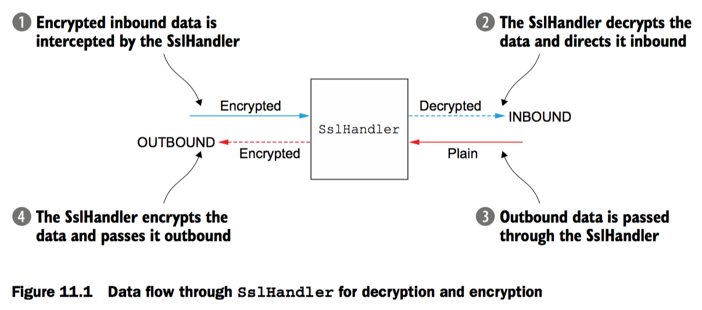

加密协议SSL/TLS Java提供了javax.net.ssl, SSLContext, SSLEngine Netty提供了SslHandler的ChannelHandler实现, 以及基于OpenSSL toolkit的SSLEngine实现: OpenSslEngine

#### Netty HTTP/HTTPS application

HTTP decoder/encoder/codec 基础接口: HttpObject 请求: FullHttpRequest(HttpRequest, HttpContent, LastHttpContent) HttpRequestEncoder/Decoder 响应: FullHttpResponse(HttpResonse, HttpContent, LastHttpContent) HttpResponseEncoder/Decoder
HTTP message aggregation HttpObjectAggregator, 不需要考虑消息片段(fragment)
HTTP compression 既有实现支持gzip和deflat压缩 HttpContentDecompressor, HttpContentCompressor
HTTPS 使用SslHandler
WebSocket WebSocketServerProtocolHandler 帧(Frame): BinaryWebSocketFrame, TextWebSocketFrame, ContinuationWebSocketFrame, CloseWebSocketFrame, PingWebSocketFrame, PongWebSocketFrame

HTTP请求组件:

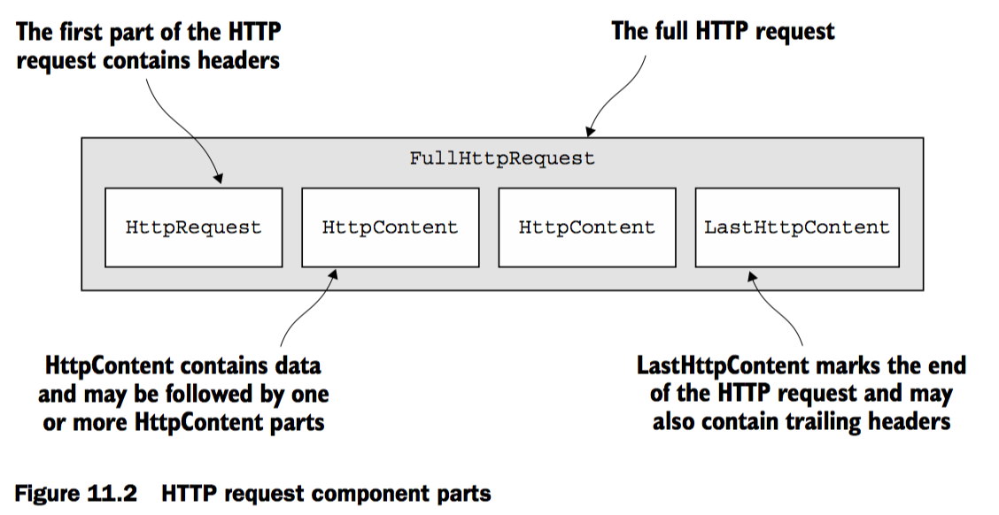

HTTP响应组件:

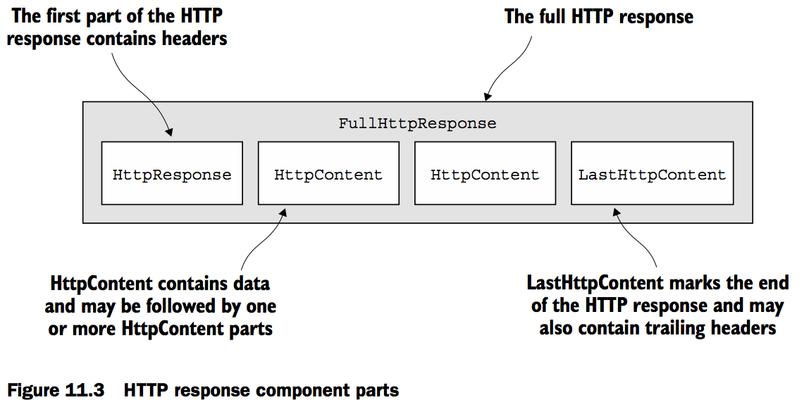

WebSocket协议:

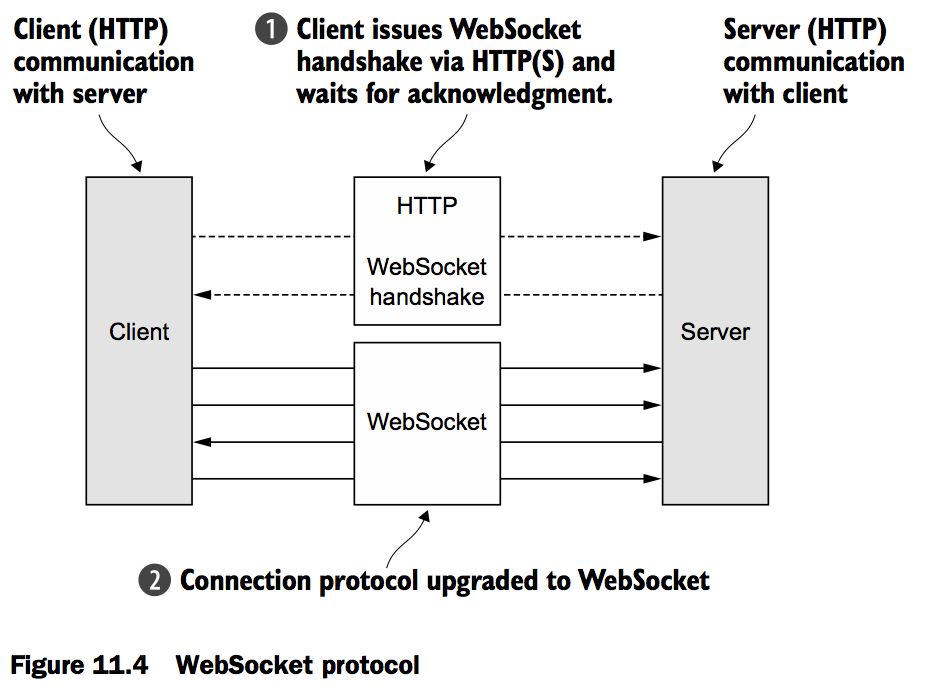

#### idle connection and timeout

#### delimited and length-based protocol

#### writing big data

#### data serializing

## PART 3 网络协议

## PART 4 案例

## Code snippet

### Channel

```
public interface Channel extends AttributeMap, ChannelOutboundInvoker, Comparable<Channel>:
  alloc(): ByteBufAllocator
  bytesBeforeUnwritable()
  bytesBeforeWritable()
  closeFuture(): ChannelFuture
  config(): ChannelConfig
  eventLoop(): EventLoop
  flush(): Channel
  id(): ChannelId
  isActive()
  isOpen()
  isRegistered()
  isWritable()
  localAddress(): SocketAddress
  metadata(): ChannelMetadata
  parent(): Channel
  pipeline(): ChannelPipeline
  read(): Channel
  remoteAddress(): SocketAddress
  unsafe(): Unsafe
```

#### EmbeddedChannel

```
public class EmbeddedChannel extends AbstractChannel:
  checkException()
  close()
  close(ChannelPromise)
  config()
  disconnect()
  disconnect(ChannelPromise)
  finish()
  finishAndReleaseAll()
  flushInbound()
  flushOutbound()
  inboundMessages()
  isActive()
  isOpen()
  lastInboundBuffer()
  lastOutboundBuffer()
  metadata()
  outboundMessages()
  readInbound()
  readOutbound()
  register()
  releaseInbound()
  releaseOutbound()
  runPendingTasks()
  runScheduledPendingTasks()
  unsafe()
  writeInbound(Object...)
  writeOneInbound(Object)
  writeOneInbound(Object, ChannelPromise)
  writeOneOutbound(Object)
  writeOneOutbound(Object, ChannelPromise)
  writeOutbound(Object...)
```

### ChannelHandler

```
public interface ChannelHandler:
  Sharable
  exceptionCaught(ChannelHandlerContext, Throwable)
  handlerAdded(ChannelHandlerContext)
  handlerRemoved(ChannelHandlerContext)
```

#### ChannelInboundHandler

```
public interface ChannelInboundHandler extends ChannelHandler:
  channelActive(ChannelHandlerContext)
  channelInactive(ChannelHandlerContext)
  channelRead(ChannelHandlerContext, Object)
  channelReadComplete(ChannelHandlerContext)
  channelRegistered(ChannelHandlerContext)
  channelUnregistered(ChannelHandlerContext)
  channelWritabilityChanged(ChannelHandlerContext)
  exceptionCaught(ChannelHandlerContext, Throwable)
  userEventTriggered(ChannelHandlerContext, Object)
```

### ChannelOutboundHandler

```
public interface ChannelOutboundHandler extends ChannelHandler:
  bind(ChannelHandlerContext, SocketAddress, ChannelPromise)
  close(ChannelHandlerContext, ChannelPromise)
  connect(ChannelHandlerContext, SocketAddress, SocketAddress, ChannelPromise)
  deregister(ChannelHandlerContext, ChannelPromise)
  disconnect(ChannelHandlerContext, ChannelPromise)
  flush(ChannelHandlerContext)
  read(ChannelHandlerContext)
  write(ChannelHandlerContext, Object, ChannelPromise)
```

### EventLoop

```
public interface EventLoop extends OrderedEventExecutor, EventLoopGroup
  parent(): EventLoopGroup
```

### Bootstrap, ServerBootstrap

```
public abstract class AbstractBootstrap<B extends AbstractBootstrap<B, C>, C extends Channel>
^-- public class Bootstrap extends AbstractBootstrap<Bootstrap, Channel>
^-- public class ServerBootstrap extends AbstractBootstrap<ServerBootstrap, ServerChannel>

AbstractBootstrap:
  attr(AttributeKey<T>, T)
  bind()
  bind(int)
  bind(String, int)
  bind(InetAddress, int)
  bind(SocketAddress)
  channel(Class<? extends C>)
  channelFactory(ChannelFactory<? extends C>)
  channelFactory(ChannelFactory<? extends C>)
  clone()
  config()
  group()
  group(EventLoopGroup)
  handler(ChannelHandler)
  localAddress(int)
  localAddress(String, int)
  localAddress(InetAddress, int)
  localAddress(SocketAddress)
  option(ChannelOption<T>, T)
  register()
  toString()
  validate()

Bootstrap:
  Bootstrap()
  clone() - @Override
  clone(EventLoopGroup)
  config() - @Override
  connect()
  connect(String, int)
  connect(InetAddress, int)
  connect(SocketAddress)
  connect(SocketAddress, SocketAddress)
  remoteAddress(String, int)
  remoteAddress(InetAddress, int)
  remoteAddress(SocketAddress)
  resolver(AddressResolverGroup<?>)
  validate() -  @Override

ServerBootstrap:
  ServerBootstrap()
  childAttr(AttributeKey<T>, T)
  childGroup() - @Deprecated
  childHandler(ChannelHandler)
  childOption(ChannelOption<T>, T)
  clone() -  @Override
  config() - @Override
  group(EventLoopGroup) -  @Override
  group(EventLoopGroup, EventLoopGroup)
  validate() - @Override
```
