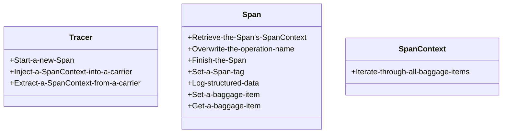

# OpenTracing

> Vendor-neutral APIs and instrumentation for distributed tracing

分布式跟踪提供了描述和分析跨进程事务的解决方案, 用例可以参考Google的Dapper论文[^1], 包括: 异常检测、诊断稳定状态问题、分布式定量分析、微服务中资源归属和工作负载建模等.

概念模型[^2]:


```
Service A             Network Call       Service B
-------------------- .............. --------------------
Parent Span    |       Span Context   Child Span
 |Child Span   |Log                    |Log    |Log
    |Child Span
      |Log  |Log
```

- `Trace`: 描述事务在分布式系统中的移动.
- `Span`: 标识工作流中一部分的命名的耗时的操作, 可以有键值对标签、细粒度的带时间戳的结构化日志.
- `Span Context`: 表示分布式事务携带的跟踪信息, 包括它何时通过网络或消息队列在服务间移动的. 包含Trace id, Span id和跟踪系统需要传播给下游服务的数据.


具体的, 在其语义规范[^3]中, `Span`封装了状态:

- 操作名称
- 开始时间戳
- 结束时间戳
- 键值对标签: 键为字符串, 值为字符串、布尔或数值类型
- `SpanContext`
- `Reference`: 对因果相关的`Span`的引用

`SpanContext`封装了状态:

- 跨进程边界引用不同`Span`所需的独立于实现的状态
- 跨进程边界的键值对: 包裹项(Baggage Items)

规范中抽象了两种`Reference`:

- `ChildOf`: 父Span依赖于子Span;
- `FollowsFrom`: 父Span不依赖于子Span.


规范中描述了三个关键类型的接口, 可以参考一些第三方实现[^4]:





[^1]: Sigelman, B. H.; Barroso, L. A.; Burrows, M. & et al. Dapper, a Large-Scale Distributed Systems Tracing Infrastructure. Google, Inc., 2010
[^2]: OpenTracing: https://opentracing.io/
[^3]: The OpenTracing Semantic Specification: https://github.com/opentracing/specification/blob/master/specification.md
[^4]: 3rd-Party OpenTracing API Contributions: https://github.com/opentracing-contrib
