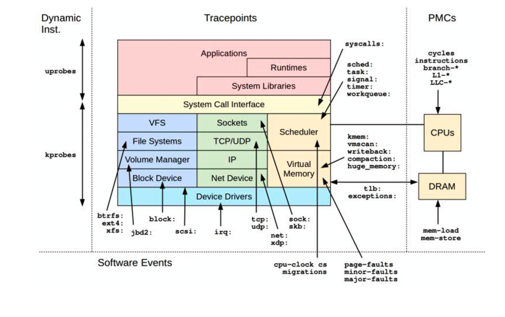

# Linux Tracing Technologies

## 资源

- [Linux Tracing Technologies](https://www.kernel.org/doc/html/latest/trace/index.html): Linux Kernel Documents
- [Linux kernel source tree](https://github.com/torvalds/linux): Linux Kerbel on Github
- [Documentation/trace](https://github.com/torvalds/linux/tree/master/Documentation/trace): Linux trace documets

## Stack Trace Walking

- frame pointer-based stack walk

栈帧链表的头部总是可以在寄存器中(x86_64 RBP)找到, 返回地址在固定偏移量处.

- debuginfo

调试信息文件: 包含ELF调试信息文件(DWARF格式).

- LBR: last branch record

Intel处理器的特性: 在硬件缓冲区中记录包括函数调用分支在内的分支.

- ORC-based statck walk: Oops Rewind Capability

一种新的调试信息格式.

## Event Sourcing

## Dynamic Tracing/Instrumentation

- 2000, DProbes by IBM: rejected
- 2004, kprobes was added to Linux
- 2005, DTrace for Solaris by Sun Microsystems: teached production environment ready
- 2012, uprobes

## Static Tracing/Instrumentation

- tracepoints: kernel static instrumentaton
- USDT(user-level statically defined tracing): user-level static instrumentation

## PMC

> programmable hardware coutners on the processor

- PMCs: performance monitoring counters
- PICs: performance instrumentation counters
- CPCs: CPU performance counters
- PMU events: performance monitoring unit events
